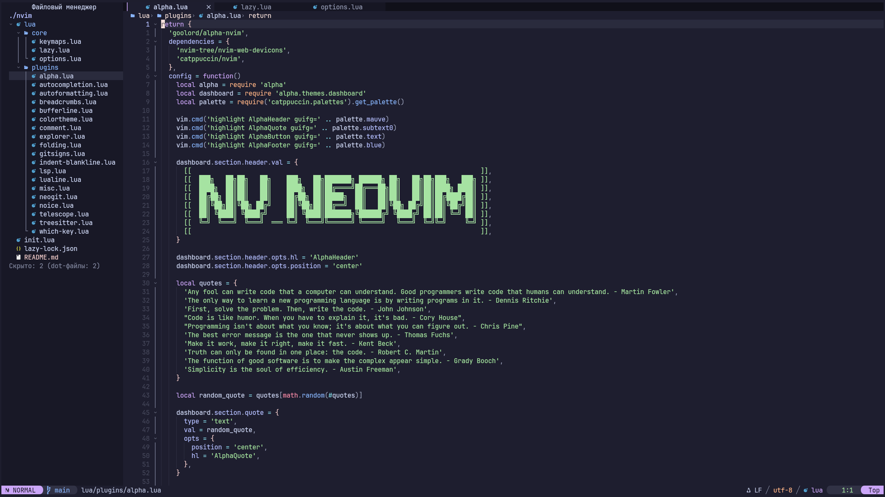
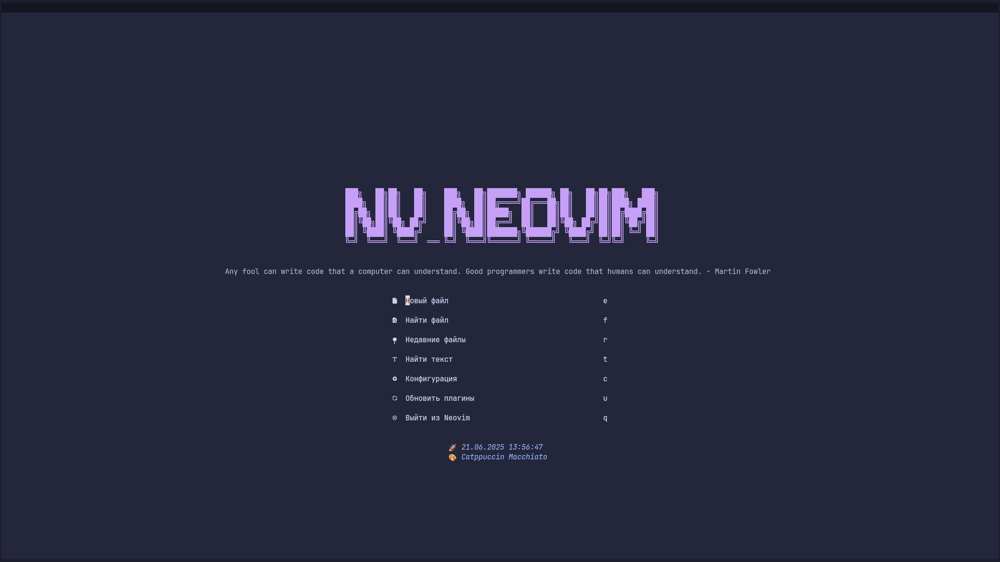
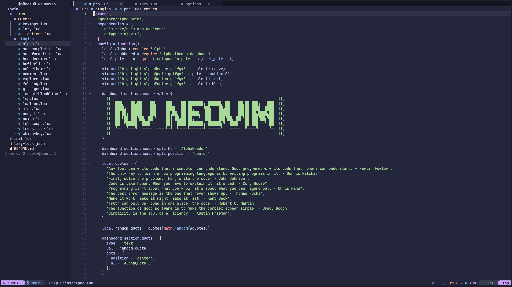
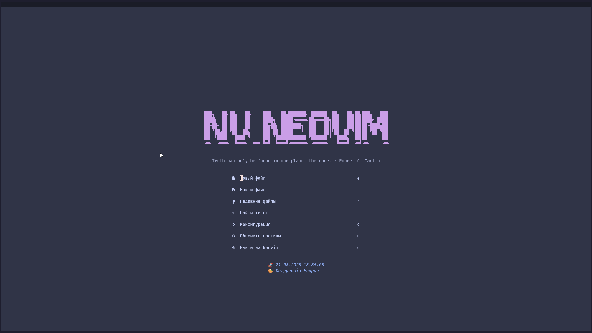
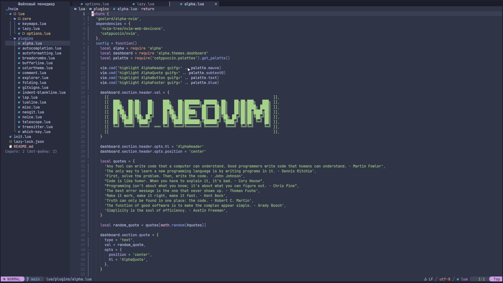
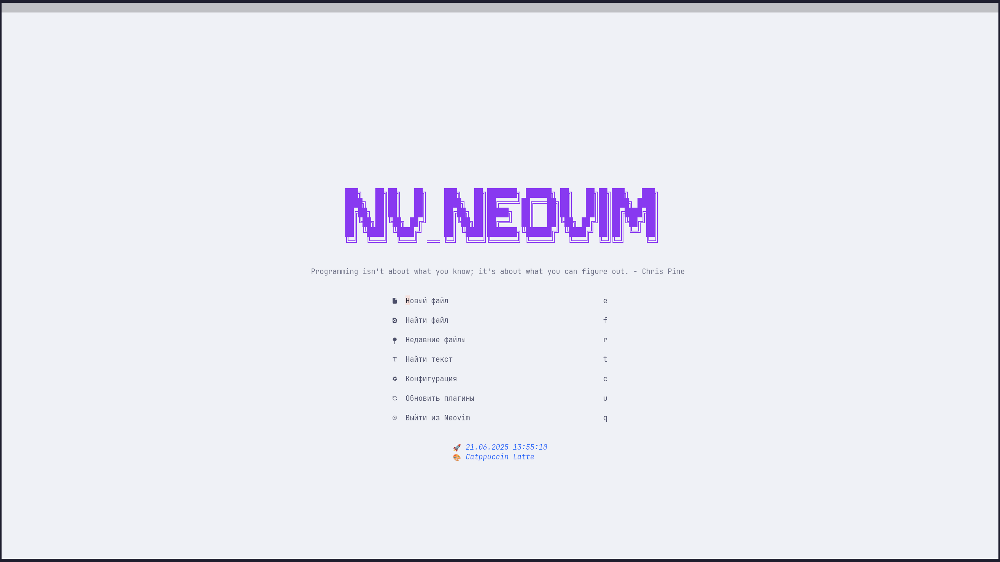
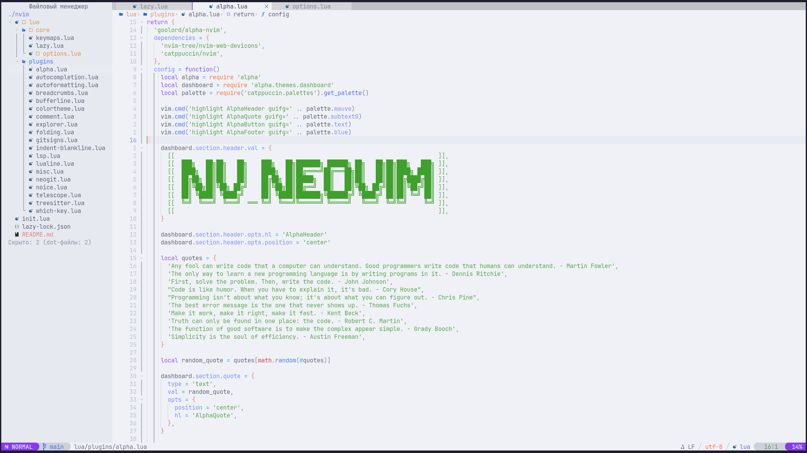
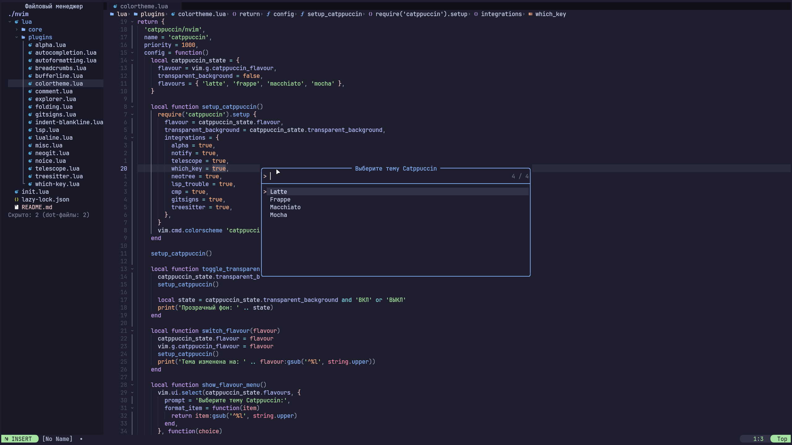

# NV_NEOVIM

<a href="https://dotfyle.com/NET-VLADOR/nvneovim"></a>
<a href="https://dotfyle.com/NET-VLADOR/nvneovim"></a>
<a href="https://dotfyle.com/NET-VLADOR/nvneovim"></a>

## Установка

> [!NOTE]
> Требуется Neovim 0.10+ или новее. Всегда проверяйте код перед установкой!

1. Клонируйте репозиторий:

```sh
git clone https://github.com/NET-VLADOR/NV_NEOVIM.git ~/.config/nvim
```

2. Запустите Neovim, плагины установятся автоматически:

```sh
nvim
```

---

## Основные возможности

### 🎨 Единая тематическая система

**Catppuccin** — не просто цветовая схема, а целостная система оформления. Все компоненты интерфейса автоматически подстраиваются под выбранную тему:

|Компонент|Описание интеграции|
|---|---|
|Стартовый экран|Динамический фон и цвета (Snacks Dashboard)|
|Строка состояния|Акцентные цвета режимов (lualine)|
|Панель вкладок|Синхронизация с основной темой (bufferline)|
|Git-индикаторы|Контекстные цвета статусов (gitsigns)|
|Диагностика|Семантические цветовые коды (trouble, lsp)|
|Уведомления|Адаптивные цвета (Snacks Notifier)|
|Хлебные крошки|Синхронизация с темой (dropbar)|
|Автодополнение|Цветовая схема меню (blink.cmp)|

<details>
<summary> 🌈 Доступные темы </summary>

|Тема|Описание|Скриншоты|
|---|---|---|
|**Mocha**|Тёмная тема (по умолчанию)|<div style="display: flex; gap: 10px;"></div>|
|**Macchiato**|Насыщенная тёмная тема|<div style="display: flex; gap: 10px;"></div>|
|**Frappe**|Умеренная тёмная тема|<div style="display: flex; gap: 10px;"></div>|
|**Latte**|Светлая тема|<div style="display: flex; gap: 10px;"></div>|
</details>

<details>
<summary>🎨 Выбор темы</summary>


</details>

### ⚡ Быстрые команды для работы с темами

|Команда|Действие|
|---|---|
|`<leader>tfl`|Переключить на тему Latte (светлая)|
|`<leader>tff`|Переключить на тему Frappe|
|`<leader>tfm`|Переключить на тему Macchiato|
|`<leader>tfM`|Переключить на тему Mocha (тёмная)|
|`<leader>tc`|Показать меню выбора темы|
|`<leader>tt`|Переключить прозрачность фона|

### 🧩 Плагины по категориям

|Категория|Плагины|
|---|---|
|**Цветовые схемы**|[catppuccin/nvim](https://github.com/catppuccin/nvim)|
|**Комментирование**|[Comment.nvim](https://github.com/numToStr/Comment.nvim), [todo-comments.nvim](https://github.com/folke/todo-comments.nvim)|
|**Автодополнение**|[blink.cmp](https://github.com/Saghen/blink.cmp), [friendly-snippets](https://github.com/rafamadriz/friendly-snippets), [blink.compat](https://github.com/Saghen/blink.cmp), [LuaSnip](https://github.com/L3MON4D3/LuaSnip)|
|**Редактирование**|[nvim-autopairs](https://github.com/windwp/nvim-autopairs), [nvim-ts-autotag](https://github.com/windwp/nvim-ts-autotag), [vim-sleuth](https://github.com/tpope/vim-sleuth)|
|**Подсветка цветов**|[nvim-highlight-colors](https://github.com/brenoprata10/nvim-highlight-colors)|
|**Файловый менеджер**|[nvim-tree.lua](https://github.com/nvim-tree/nvim-tree.lua)|
|**Форматирование**|[conform.nvim](https://github.com/stevearc/conform.nvim)|
|**Поиск**|[telescope.nvim](https://github.com/nvim-telescope/telescope.nvim), [telescope-fzf-native.nvim](https://github.com/nvim-telescope/telescope-fzf-native.nvim), [telescope-ui-select.nvim](https://github.com/nvim-telescope/telescope-ui-select.nvim)|
|**Поиск и замена**|[grug-far.nvim](https://github.com/MagicDuck/grug-far.nvim)|
|**Git**|[diffview.nvim](https://github.com/sindrets/diffview.nvim), [gitsigns.nvim](https://github.com/lewis6991/gitsigns.nvim), [lazygit.nvim](https://github.com/kdheepak/lazygit.nvim), [vim-fugitive](https://github.com/tpope/vim-fugitive), [vim-rhubarb](https://github.com/tpope/vim-rhubarb)|
|**Интерфейс**|[lualine.nvim](https://github.com/nvim-lualine/lualine.nvim), [bufferline.nvim](https://github.com/akinsho/bufferline.nvim), [dropbar.nvim](https://github.com/Bekaboo/dropbar.nvim), [noice.nvim](https://github.com/folke/noice.nvim), [nvim-web-devicons](https://github.com/nvim-tree/nvim-web-devicons), [which-key.nvim](https://github.com/folke/which-key.nvim), [snacks.nvim](https://github.com/folke/snacks.nvim) (dashboard, indent, notifier, terminal, statuscolumn)|
|**LSP**|[mason.nvim](https://github.com/williamboman/mason.nvim), [mason-lspconfig.nvim](https://github.com/williamboman/mason-lspconfig.nvim), [mason-tool-installer.nvim](https://github.com/WhoIsSethDaniel/mason-tool-installer.nvim), [nvim-lspconfig](https://github.com/neovim/nvim-lspconfig), [lazydev.nvim](https://github.com/folke/lazydev.nvim)|
|**Treesitter**|[nvim-treesitter](https://github.com/nvim-treesitter/nvim-treesitter)|
|**Сворачивание**|[nvim-ufo](https://github.com/kevinhwang91/nvim-ufo), [promise-async](https://github.com/kevinhwang91/promise-async)|
|**Диагностика**|[trouble.nvim](https://github.com/folke/trouble.nvim)|
|**Навигация**|[vim-tmux-navigator](https://github.com/christoomey/vim-tmux-navigator)|
|**Управление буферами**|[vim-bbye](https://github.com/moll/vim-bbye)|
|**Прочее**|[mdx.nvim](https://github.com/davidmh/mdx.nvim) (MDX support), [nvim-notify](https://github.com/rcarriga/nvim-notify) (уведомления), [nui.nvim](https://github.com/MunifTanjim/nui.nvim) (UI компоненты), [plenary.nvim](https://github.com/nvim-lua/plenary.nvim) (утилиты), [showkeys](https://github.com/nvzone/showkeys) (отображение клавиш)|

### 🌐 Языковые серверы (LSP)

Автоматическая настройка через Mason:

|Сервер|Языки|
|---|---|
|`lua_ls`|Lua|
|`ts_ls`|TypeScript/JavaScript|
|`bashls`|Bash|
|`html`|HTML|
|`cssls`|CSS|
|`tailwindcss`|Tailwind CSS|
|`dockerls`|Docker|
|`jsonls`|JSON|
|`yamlls`|YAML|
|`eslint`|JavaScript/TypeScript|
|`mdx_analyzer`|MDX|
|`rust_analyzer`|Rust|
|`sqlls`|SQL|

---

## Особенности работы

### 🔄 Динамическое обновление интерфейса

При смене темы Catppuccin автоматически обновляются:
- Стартовый экран (Snacks Dashboard)
- Строка состояния (lualine)
- Панель вкладок (bufferline)
- Контекстное меню (dropbar)
- Уведомления (Snacks Notifier)
- Хлебные крошки (dropbar)
- Автодополнение (blink.cmp)
- Lazygit

### 🎨 Гибкая настройка тем

- 4 встроенные темы с полной синхронизацией
- Динамическая прозрачность фона
- Автоматическая адаптация для светлого/тёмного режима

### ⚙️ Системные компоненты

- **Менеджер плагинов:** [lazy.nvim](https://github.com/folke/lazy.nvim)
- **Иконки:** [nvim-web-devicons](https://github.com/nvim-tree/nvim-web-devicons)
- **Уведомления:** [nvim-notify](https://github.com/rcarriga/nvim-notify) + Snacks Notifier
- **Расширенный UI:** [noice.nvim](https://github.com/folke/noice.nvim)
- **Дашборд:** [snacks.nvim](https://github.com/folke/snacks.nvim)
- **Интеграция с tmux:** [vim-tmux-navigator](https://github.com/christoomey/vim-tmux-navigator)
- **Git TUI:** [lazygit.nvim](https://github.com/kdheepak/lazygit.nvim)

### 🔧 Git инструменты

|Хоткей|Действие|
|---|---|
|`<leader>G`|Открыть lazygit (плавающее окно)|
|`<leader>gs`|Добавить изменение в индекс (stage hunk)|
|`<leader>gr`|Отменить изменения (reset hunk)|
|`<leader>gS`|Добавить весь файл в индекс|
|`<leader>gR`|Отменить все изменения в файле|
|`<leader>gp`|Предпросмотр изменения (inline)|
|`<leader>gP`|Предпросмотр изменения (float)|
|`<leader>gd`|Сравнить с индексом (diff)|
|`<leader>gD`|Сравнить с последним коммитом|
|`<leader>gb`|Показать автора строки (blame)|
|`<leader>gB`|Открыть blame (полный)|
|`<leader>gh`|Выделить текущее изменение|
|`]g` / `[g`|Следующее / предыдущее изменение|
|`<leader>gx`|Сменить базу на HEAD~|
|`<leader>gq`|Показать все изменения (quickfix)|

#### Git Toggle (переключение)

|Хоткей|Действие|
|---|---|
|`<leader>gt`|Переключить blame строки|
|`<leader>gTs`|Переключить знаки изменений|
|`<leader>gTn`|Переключить подсветку номеров|
|`<leader>gTl`|Переключить подсветку строк|
|`<leader>gTw`|Переключить подсветку слов|
|`<leader>gTd`|Переключить удалённые строки|

## Обновление конфигурации

```sh
cd ~/.config/nvim && git pull
```

## Рекомендации

- Используйте [Nerd Fonts](https://www.nerdfonts.com/) для корректного отображения иконок
- Для лучшей производительности используйте Neovim 0.10+
- Обновляйте плагины регулярно: `u` на главной странице или через `Lazy`
